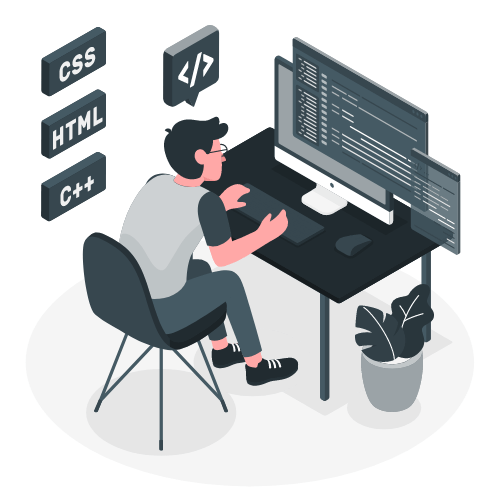

<h1 align="center">Hi 👋, I'm Luiz Pedro</h1>

## A passionate developer from Brazil

- 🌱 I’m currently learning **Laravel, NodeJs, React, React Native**

- 👨‍💻 My projects are available at [portifolio]

## Participations

#### Maratona Behind the Code 2020 (2020-08-15 ~ 2020-09-18)

[Maratona](https://github.com/LuizPedroSM/maratona-btc-2020)

### Hackathons

[Mega Rank](https://app.shawee.io/@luizpsmoreira)

#### Hackathon Call for Code PT-BR - COVID-19 (2020-07-24 ~ 2020-08-06)

[Projeto: Behavior](https://github.com/Call-for-Code-time-77/server)

#### Hackathon TecBan (2020-07-24 ~ 2020-07-30)

[Projeto: ShareBank](https://github.com/ShareBank/server)

#### Hackathon Campus Party (2020-07-09 ~ 2020-07-11)

[Projeto: Residu - Coleta de Resíduo](https://github.com/hackaCampusParty/HackthonProject)

#### Mega Hack 3ª (2020-06-26 ~ 2020-07-14)

[Projeto: AGS - Aplicativo de Gestão Sanitária](https://github.com/MegaHack3-16/hackathon)

#### Hackathon CCR (2020-06-10 ~ 2020-06-18)

[Projeto: Compartilhando Cargas](https://github.com/MegaHack3-16/hackathon)

## Connect with me:

[][linkedin]
[][behance]

[portifolio]: https://luizpedrosm.github.io/
[linkedin]: https://linkedin.com/in/luizpedrosm
[behance]: https://www.behance.net/luizpedrosm
